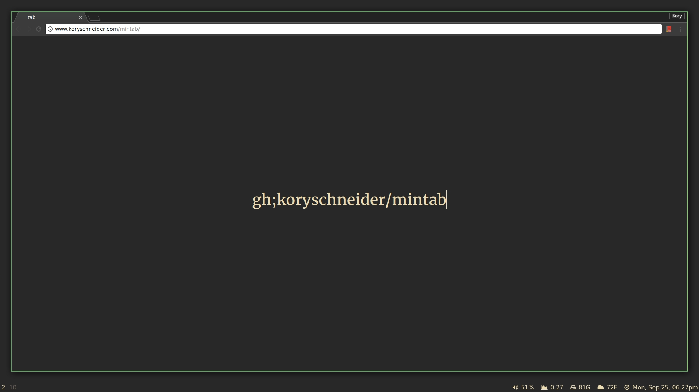

# [mintab][mintab]

### What
a _really_ minimal [startpage][mintab]

### How
see [this page](doc/commands.md) for instructions

### Extension
use [this nifty browser extension][chrome ext] to make mintab your new tab page

### Screenshot
it looks like this:

[mintab]: https://koryschneider.github.io/mintab
[chrome ext]: https://chrome.google.com/webstore/detail/mintab/ggkhmapnplaljplbhkbdjkbjadbhadap
